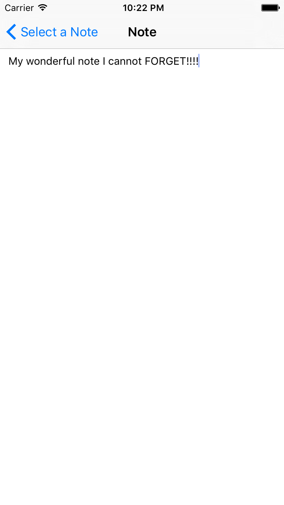
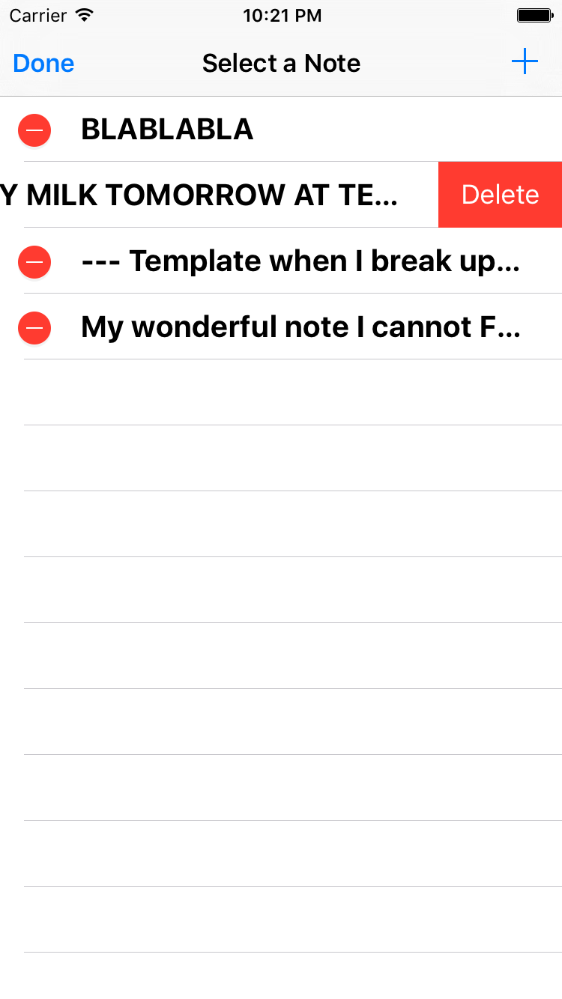

# Simple iPhone Swift Notepad App

**pH Simple NotePad** is a very basic and clear Swift notepad app for iPhone, iOS 8/9 and so on.

Like my [Desktop Java Text Editor](https://github.com/pH-7/Simple-Java-Text-Editor), this [Swift](https://swift.org) iPhone app is easy to understand for beginners and contains several useful comments.

## The Author

[Pierre-Henry Soria](https://github.com/pH-7/)

## Contact

You can send an email at **pierrehenrysoria [AT] gmail {D0T} COM**

## License

[MIT License](http://opensource.org/licenses/mit-license.php)
